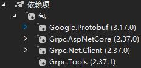

# gRPC

### 创建gRPC项目

refs: [创建 gRPC 服务和方法 | Microsoft Docs](https://docs.microsoft.com/zh-cn/aspnet/core/grpc/services?view=aspnetcore-3.1)

refs: [Basics tutorial | C#(主要看这个) | gRPC](https://grpc.io/docs/languages/csharp/basics/#example-code-and-setup)

+ 创建项目
+ 引用package,其中*Grpc.Tools-属性-私有资产(privateassets)=all*

### 定义gRPC服务

+ 在Protos-greet.proto文件中定义 : Greeter服务、SayHello调用、发送HelloRequest消息、接收HelloReply消息

```protobuf
syntax = "proto3";

option csharp_namespace = "GrpcSample";

package greet;

// The greeting service definition.
service Greeter {
  // Sends a greeting
  rpc SayHello (HelloRequest) returns (HelloReply);
  //Unary
  rpc UnaryCall(ExampleRequest) returns (ExampleResponse);
  //Server streaming
  rpc StreamingFromServer (ExampleRequest) returns (stream ExampleResponse);
  //Client streaming
  rpc StreamingFromClient (stream ExampleRequest) returns (ExampleResponse);
  //Bi-dirctional streaming
  rpc StreamingBothWays (stream ExampleRequest) returns (stream ExampleResponse);

}

// The request message containing the user's name.
message HelloRequest {
  string name = 1;
}

// The response message containing the greetings.
message HelloReply {
  string message = 1;
}

message ExampleRequest{
	int32 pageIndex = 1;
	int32 pageSize = 2;
	bool isDescending = 3;
}

message ExampleResponse{
	string response = 1;
}
```

+ **右键生成项目**, Grpc.Tools会自动生成Services-GreeterService.cs(**在DEBUG/RELEASE中**), 可重写对应的方法

```c#
using Grpc.Core;
using Microsoft.Extensions.Logging;
using System;
using System.Collections.Generic;
using System.Linq;
using System.Threading.Tasks;

namespace GrpcSample
{
    public class GreeterService : Greeter.GreeterBase
    {
        private readonly ILogger<GreeterService> _logger;
        public GreeterService(ILogger<GreeterService> logger)
        {
            _logger = logger;
        }

        public override Task<HelloReply> SayHello(HelloRequest request, ServerCallContext context)
        {
            return Task.FromResult(new HelloReply
            {
                Message = "Hello " + request.Name
            });
        }

        public override Task<ExampleResponse> UnaryCall(ExampleRequest request, ServerCallContext context)
        {
            var response = new ExampleResponse();
            return Task.FromResult(response);
        }

        public override async Task<ExampleResponse> StreamingFromClient(IAsyncStreamReader<ExampleRequest> requestStream, ServerCallContext context)
        {
            while (await requestStream.MoveNext())
            {
                var message = requestStream.Current;
            }
            return new ExampleResponse();
        }
    }
}

```

+ protobuf消息数据类型与C#数据类型对照: 

  [为 .NET 应用创建 Protobuf 消息 | Microsoft Docs](https://docs.microsoft.com/zh-cn/aspnet/core/grpc/protobuf?view=aspnetcore-3.1#scalar-value-types)

### 使用gRPC.Tools生成gRPC服务**(基本不用)**

> 安装:
>
> 其中: Grpc.Tools中有 **protoc.exe**以及**grpc_csharp_plugin.exe**
>
> 示例存放路径:
>
> ``C:\Users\dell\.nuget\packages\grpc.tools\2.34.0\tools\windows_x64``

> cmd命令:
>
> ```bash
> [protoc.exe路径] -I [项目根目录] --csharp_out [实现类的生成路径] [.proto文件路径] --grpc_out [xxxGrpc.cs文件输出路径] --plugin=protoc-gen-grpc=[grpc_csharp_plugin.exe路径]
> ```

#### gRpc实战操作

> **创建protobuf文件**:

- 在需要gRpc服务的解决方案下添加.gRPC项目, 项目类型`类库`

- 项目结构: 

```
ApiServer.sln
	|- Api.Demo(Web Api Project)
	|- Api.Demo.gRPC (Class Project)
```

- 添加`{service.proto}`文件
- `.proto`文件的`namespace`为 Demo.Protobuf

> **生成服务端**:

- 在ApiServer中添加gRPC服务

  1. 项目-右键
  2. Add
  3. Add Service Reference(添加服务引用)
  4. Add new gRPC service Reference(添加新的gRPC服务引用)
  5. 选择`proto`文件
  6. select the type of class to be generate : Server(选择生成文件类型:服务端)

- 实现Server的代码

  1. 创建服务实现类, 继承gRPC服务基类: `proto`中定义的service名称为Greeter, 则基类一般为Greeter.GreeterBase
  2. 重载gRPC方法(override), 实现业务逻辑, 支持Ioc(依赖注入)
  3. 在Startup中配置gRPC服务

  ```c#
  public void ConfigureServices(IServiceCollection services)
  {
      services.AddGrpc();
  }
  
  public void Configure(IApplicationBuilder app)
  {
      app.UseEndpoints(endpoints => 
                       {
                           endpoints.MapGrpcSerice<StaffRpcServer>();
                       });
  }
  ```

> **生成客户端**:

- 在`proto`项目类库中按照服务端添加gRPC服务的流程, 添加Client的gRPC服务, 在生成文件类型时选择Client即可
- 添加IServiceCollection扩展

```c#
public static class ServiceExtension
{
    public static IServiceCollection AddStaffRpcClient(this IServiceCollection svc)
    {
        AppContext.SetSwitch("System.Net.Http.SocketsHttpHandler.Http2UnencryptedSupport",true);
        svc.AddGrpcClient<Protobuf.Staff.StaffClient>(cfg=>
                                                      {
                                                          cfg.Address = new Uri("http://staff-svc:8080");//服务地址
                                                      });
        return svc;
    }
}
```

- 配置使用8080端口
- 将类库构建为Nuget包

> **服务端配置**

- gRPC服务使用过程中有几点需要注意：

  1. gRPC服务仅支持HTTP/2协议，同时推荐使用TLS进行通讯加密
  2. Asp.net core 服务中，面向web的API接口无法单独支持HTTP2
  3. 所以在配置gRPC服务的时候，由于使用相同的WebHost，所以需要通过监听不同的端口协议，用于区分API请求和gRPC请求
  4. 由于TLS证书的配置管理问题，目前不进行TLS加密处理

  基于以上几点，需要从服务端进行若干配置，建议开放8080端口应用于gRPC服务。

  1、 Dockerfile 中添加 8080

  ```javascript
  EXPOSE 80 8080
  ```

  2、 kubenetes 中暴露8080 端口

  ```yaml
  -- Deployment
      - env:
           - name: ASPNETCORE_URLS
             value: 'http://+:80;http://+:8080'
      - ports:
           - containerPort: 8080
             protocol: TCP
  -- Service 
      -ports:
          - name: grpc
            port: 8080
            protocol: TCP
  ```

  需要注意到Service中添加多个端口的时候，需要分别添加 name属性用于区分。

  3、 服务中配置为8080端口配置 http2

  ```csharp
  # Program.cs
   public static IHostBuilder CreateHostBuilder(string[] args) =&gt;
      Host.CreateDefaultBuilder(args)
          .ConfigureWebHostDefaults(webBuilder =&gt;
          {
              webBuilder.UseStartup&lt;Startup&gt;();
              webBuilder.ConfigureKestrel(opt =&gt;
              {
                  opt.ConfigureEndpointDefaults(c =&gt;
                  {
                      if(c.IPEndPoint.Port == 8080)
                      {
                          c.Protocols = Microsoft.AspNetCore.Server.Kestrel.Core.HttpProtocols.Http2;
                      }
                  });
              });
          });
  # Startup.cs
  
  public void ConfigureServices(IServiceCollection services) {
      services.AddGrpc();
  }
  
   public void Configure(IApplicationBuilder app, IWebHostEnvironment env, IApiVersionDescriptionProvider provider)
  {
       app.UseEndpoints(cfg =&gt; {
                  cfg.MapControllers();
                  cfg.MapGrpcService&lt;WechatContainerRpc&gt;();
              });
  }
  ```

  4、 客户端项目中添加 Http2UnencryptedSupport 支持
  即在 ServiceCollectionExtension中添加 `AppContext.SetSwitch("System.Net.Http.SocketsHttpHandler.Http2UnencryptedSupport", true);`

  ```csharp
  public static class WechatContainerExtension
  {
      public static IServiceCollection AddWechatContainerService(this IServiceCollection svc)
      {
          AppContext.SetSwitch("System.Net.Http.SocketsHttpHandler.Http2UnencryptedSupport", true);
          svc.AddGrpcClient&lt;Protobuf.WechatContainer.WechatContainerClient&gt;(cfg =&gt;
          {
              cfg.Address = new Uri("http://wechat-open-svc:8080");
          });
          svc.AddScoped&lt;IComponentContainer, WechatContainerService&gt;();
          svc.AddScoped&lt;IAccessTokenContainer, WechatContainerService&gt;();
          return svc;
      }
  }
  ```

