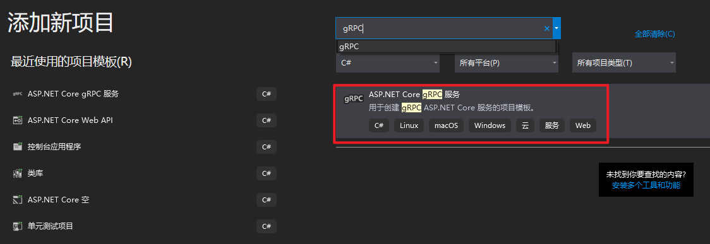

# gRPC

### 创建gRPC项目

refs: [创建 gRPC 服务和方法 | Microsoft Docs](https://docs.microsoft.com/zh-cn/aspnet/core/grpc/services?view=aspnetcore-3.1)

refs: [Basics tutorial | C#(主要看这个) | gRPC](https://grpc.io/docs/languages/csharp/basics/#example-code-and-setup)

+ 创建项目
+ 引用package,其中*Grpc.Tools-属性-私有资产(privateassets)=all*

### 定义gRPC服务

+ 在Protos-greet.proto文件中定义 : Greeter服务、SayHello调用、发送HelloRequest消息、接收HelloReply消息

```protobuf
syntax = "proto3";

option csharp_namespace = "GrpcSample";

package greet;

// The greeting service definition.
service Greeter {
  // Sends a greeting
  rpc SayHello (HelloRequest) returns (HelloReply);
  //Unary
  rpc UnaryCall(ExampleRequest) returns (ExampleResponse);
  //Server streaming
  rpc StreamingFromServer (ExampleRequest) returns (stream ExampleResponse);
  //Client streaming
  rpc StreamingFromClient (stream ExampleRequest) returns (ExampleResponse);
  //Bi-dirctional streaming
  rpc StreamingBothWays (stream ExampleRequest) returns (stream ExampleResponse);

}

// The request message containing the user's name.
message HelloRequest {
  string name = 1;
}

// The response message containing the greetings.
message HelloReply {
  string message = 1;
}

message ExampleRequest{
	int32 pageIndex = 1;
	int32 pageSize = 2;
	bool isDescending = 3;
}

message ExampleResponse{
	string response = 1;
}
```

+ **右键生成项目**, Grpc.Tools会自动生成Services-GreeterService.cs(**在DEBUG/RELEASE中**), 可重写对应的方法

```c#
using Grpc.Core;
using Microsoft.Extensions.Logging;
using System;
using System.Collections.Generic;
using System.Linq;
using System.Threading.Tasks;

namespace GrpcSample
{
    public class GreeterService : Greeter.GreeterBase
    {
        private readonly ILogger<GreeterService> _logger;
        public GreeterService(ILogger<GreeterService> logger)
        {
            _logger = logger;
        }

        public override Task<HelloReply> SayHello(HelloRequest request, ServerCallContext context)
        {
            return Task.FromResult(new HelloReply
            {
                Message = "Hello " + request.Name
            });
        }

        public override Task<ExampleResponse> UnaryCall(ExampleRequest request, ServerCallContext context)
        {
            var response = new ExampleResponse();
            return Task.FromResult(response);
        }

        public override async Task<ExampleResponse> StreamingFromClient(IAsyncStreamReader<ExampleRequest> requestStream, ServerCallContext context)
        {
            while (await requestStream.MoveNext())
            {
                var message = requestStream.Current;
            }
            return new ExampleResponse();
        }
    }
}

```

+ protobuf消息数据类型与C#数据类型对照: 

  [为 .NET 应用创建 Protobuf 消息 | Microsoft Docs](https://docs.microsoft.com/zh-cn/aspnet/core/grpc/protobuf?view=aspnetcore-3.1#scalar-value-types)

### 使用gRPC.Tools生成gRPC服务**(基本不用)**

> 安装:
>
> 其中: Grpc.Tools中有 **protoc.exe**以及**grpc_csharp_plugin.exe**
>
> 示例存放路径:
>
> ``C:\Users\dell\.nuget\packages\grpc.tools\2.34.0\tools\windows_x64``

> cmd命令:
>
> ```bash
> [protoc.exe路径] -I [项目根目录] --csharp_out [实现类的生成路径] [.proto文件路径] --grpc_out [xxxGrpc.cs文件输出路径] --plugin=protoc-gen-grpc=[grpc_csharp_plugin.exe路径]
> ```